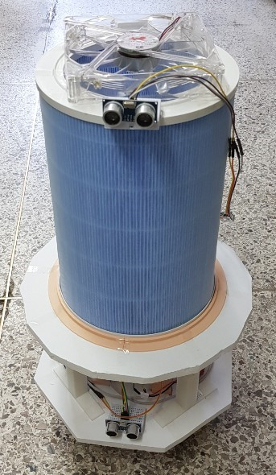
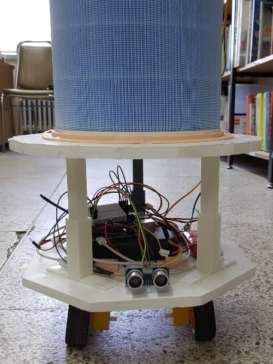

# SmartMobilePurifier-RPI3Bplus

## Idea provider : 정인범 교수님(Professor Jung)
## Requirement Analysis & Proposal : 장휘용(Hwiyong Chang), 이강호(Gangho Lee), 최인욱(Inuk Choi), 김우종(?)
## Implementer : 장휘용(Hwiyong Chang)

#### Top view

#### Front view

### Play
https://www.youtube.com/watch?v=rxxtXJhF6ds
